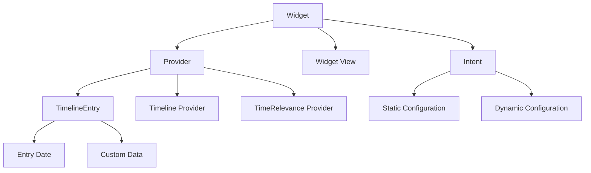
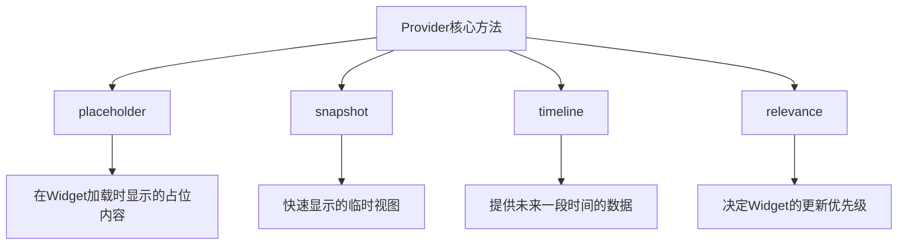

# 介绍

我们在这篇文章中，会介绍 Widget 的基础知识

如果你考虑为 App 增加小组件，我只推荐设置 iOS 17+作为最新版本

为什么？

-   iOS 17 正式引入交互式小组件，这是 iOS 16 无法实现的，交互式也是小组件最大的亮点之一
-   iOS 17 带来了一套全新的小组件 API，能够帮助你快速的和 CoreData 联动
-   使用新的 API 编写的 AppIntent，会自动转换成快捷指令，不需要再单独为快捷指令生成 AppIntent 了，非常方便

WWDC23 的官方文档，你可以查阅所有关于小组件的更新：

https://developer.apple.com/documentation/updates/wwdc2023

**声明**

本篇文章介绍 Home Screen Widget（桌面小组件）和 Lock Screen Widget（锁屏小组件）两种类型的小组件

并且持久化方案使用的是 Core Data

篇幅有限，没有办法展开说细节，以实战为主，但是我会在文章中推荐学习资料，感兴趣可以扩展阅读

# Widget 基础知识

## **官方定义**

> Widgets elevate a small amount of timely, personally relevant information from your app, display it where people can see it at a glance, and offer specific app functionality without launching the app

Widget 展示了你的 App 中少量及时的、与用户相关的信息，在用户可以一眼看到的地方显示这些信息，并在无需启动 App 的情况下提供特定的 App 功能。

这说明几个重点：

-   Widget 不是独立的 App，而是 App 的扩展
-   Widget 的信息应该及时、准确
-   Widget 能够让用户不进入 App 的情况下和特定功能交互

关于如何设计优秀的 Widget，下面有一些推荐资料：

HIG 人机交互指南是必看的，剩下两个 WWDC 推荐学习苹果对 Widget 的理念

https://developer.apple.com/design/human-interface-guidelines/widgets

https://developer.apple.com/videos/play/wwdc2021/10048/

https://developer.apple.com/videos/play/wwdc2020/10103/

## **发展历程**

iOS 14 (2020) 是 Widget 的重大更新，Widget 可以放置在主屏幕了

iOS 16 (2022) 引入了锁屏 Widget

iOS 17 (2023) 是第二个重大更新，不仅支持和 Widget 交互，还带来了一大批新的 Widget API

iOS 18 (2024) 带来了控制中心的 Widget

## 概念

Widget 稍微有点复杂，初次接触很难理解这些抽象的命名，但是学习一段时间后你会发现它设计得还挺好的



首先 Widget 至少包含三个部件：

1. **Widget View**，也就是 Widget 展示的内容
2. **Provider**，内容背后的数据提供者，和 WidgetView 是 View 和 Data source 的关系
3. **Intent**，意图，是对用户操作行为的抽象，比如说用户可以自己选择数据源，或者进行某些开关配置，来修改 WidgetView 的内容

### Widget View（小组件视图）

在你配置完毕之后，Xcode 会给你生成一个默认的模版，下面就是一个 Widget View，你把 Provider.Entry 去掉后，会发现和它其实就和普通的 SwiftUI 视图一样，没什么特别的

```swift
struct LearnSwiftUIWidgetEntryView : View {
    var entry: Provider.Entry

    var body: some View {
        VStack {
            Text("Time:")
            Text(entry.date, style: .time)

            Text("Favorite Emoji:")
            Text(entry.configuration.favoriteEmoji)
        }
    }
}
```

### Provider - AppIntentTimelineProvider

之前说了，Provider 是数据提供者，下面同样是模版代码，让我们一个个来拆解

```swift
struct Provider: AppIntentTimelineProvider {
    func placeholder(in context: Context) -> SimpleEntry {
        SimpleEntry(date: Date(), configuration: ConfigurationAppIntent())
    }

    func snapshot(for configuration: ConfigurationAppIntent, in context: Context) async -> SimpleEntry {
        SimpleEntry(date: Date(), configuration: configuration)
    }

    func timeline(for configuration: ConfigurationAppIntent, in context: Context) async -> Timeline<SimpleEntry> {
        var entries: [SimpleEntry] = []

        // Generate a timeline consisting of five entries an hour apart, starting from the current date.
        let currentDate = Date()
        for hourOffset in 0 ..< 5 {
            let entryDate = Calendar.current.date(byAdding: .hour, value: hourOffset, to: currentDate)!
            let entry = SimpleEntry(date: entryDate, configuration: configuration)
            entries.append(entry)
        }

        return Timeline(entries: entries, policy: .atEnd)
    }

//    func relevances() async -> WidgetRelevances<ConfigurationAppIntent> {
//        // Generate a list containing the contexts this widget is relevant in.
//    }
}

struct SimpleEntry: TimelineEntry {
    let date: Date
    let configuration: ConfigurationAppIntent
}
```

首先一个 Provider 至少有四个方法：

-   placeholder：Widget 首次加载或重新加载时，提供加载时的占位视图，不用包含真实数据
-   snapshot：提供快速预览内容，就是用户搜索 App 的 Widget 的时候，看到你的小组件预览效果
-   timeline：提供未来一段时间的数据更新计划，决定何时展示什么内容
-   relevances，是智能堆叠这个 feature 用到的，不需要可以不写



回到代码：

```swift
    func placeholder(in context: Context) -> SimpleEntry {
        SimpleEntry(date: Date(), configuration: ConfigurationAppIntent())
    }

    func snapshot(for configuration: ConfigurationAppIntent, in context: Context) async -> SimpleEntry {
        SimpleEntry(date: Date(), configuration: configuration)
    }
```

你可以看到这两个方法非常相似，但是区别是 placeholder 不会有任何数据，都是初始化的，而 snapshot 的签名，是带有 configuration 的，那么 SimpleEntry 可以通过 configuration 拿到特定数据的，两者的区别从签名就体现出来了。configuration 对应的 ConfigurationAppIntent 我们后面会讲，现在你把它当成一个配置就好。

然后是 timeline：

```swift

    func timeline(for configuration: ConfigurationAppIntent, in context: Context) async -> Timeline<SimpleEntry> {
        var entries: [SimpleEntry] = []

        // Generate a timeline consisting of five entries an hour apart, starting from the current date.
        let currentDate = Date()
        for hourOffset in 0 ..< 5 {
            let entryDate = Calendar.current.date(byAdding: .hour, value: hourOffset, to: currentDate)!
            let entry = SimpleEntry(date: entryDate, configuration: configuration)
            entries.append(entry)
        }

        return Timeline(entries: entries, policy: .atEnd)
    }
```

假设你是一个天气 App，你希望有一个 Widget，展示未来 5 个小时的天气状态，那么你就需要 Timeline 了，上面的代码就是规划了一个 5 小时的 Timeline，决定这 5 个小时中每个小时展示什么内容

而 SimpleEntry 的定义是符合 TimelineEntry 的，也就是说 Timeline - TimelineEntry 共同组成了一个时间轴，告诉 Widget 如何更新、展示什么

```swift
struct SimpleEntry: TimelineEntry {
    let date: Date
    let configuration: ConfigurationAppIntent
}
```

### Intent - WidgetConfigurationIntent

同样是 Xcode 生成的模版代码，你可以看到这里面的内容

```swift
struct ConfigurationAppIntent: WidgetConfigurationIntent {
    static var title: LocalizedStringResource { "Configuration" }
    static var description: IntentDescription { "This is an example widget." }

    // An example configurable parameter.
    @Parameter(title: "Favorite Emoji", default: "😃")
    var favoriteEmoji: String
}

```

title 和 description 是小组件的描述

而@Parameter 是重点，这是一个语法糖，被它包裹的变量，将会是可配置的，比如说这里面默认是一个”😃”，但是用户也可以自行输入其它 emoji、文本。

@Parameter 其实是 IntentParameter 的语法糖

https://developer.apple.com/documentation/appintents/intentparameter

它支持以下类型参数：

-   基础数据类型：String、Int、Double、Bool
-   日期和时间：Date、DateInterval
-   枚举类型：遵循 AppEnum 协议的枚举
-   系统类型：Color
-   集合类型：数组（如[String]、[CustomEnum]等）
-   可选类型：任何上述类型的可选形式
-   **自定义类型：遵循 AppEntity 协议的自定义类型**

其中自定义类型是最重要的，稍后会在适配 CoreData 中重点介绍

## 为什么是 iOS 17

查看文档你会发现，这两个 Widget 都是 iOS17 提供的 API

WidgetConfigurationIntent

AppIntentTimelineProvider

其中 WidgetConfigurationIntent 继承自[AppIntent](https://developer.apple.com/documentation/appintents/appintent)

而 AppIntentTimelineProvider 也是 iOS 17 带来的新的 API，与之对应的旧版 API 是：IntentTimelineProvider 和 TimelineProvider，两者都是 iOS14+，也就是 2020 年发布的 API

下面是这些 API 的文档：

https://developer.apple.com/documentation/widgetkit/intenttimelineproviderhttps://developer.apple.com/documentation/widgetkit/timelineprovider

https://developer.apple.com/documentation/appintents/widgetconfigurationintent

https://developer.apple.com/documentation/appintents/appintent

为什么很多人觉得小组件学习很困难呢？这是因为很多你搜到的资料都是以 iOS17 之前为主的，就算是 Claude 和 GPT 有时候也会给你返回旧的 API，而旧的 API 除了概念复杂以外，配置也非常麻烦，直接导致很多人觉得小组件混乱、模糊。

实际上苹果在 iOS17 做出了很多努力，所以我再次推荐使用使用新版本的 API 来开发，能极大的增加开发效率。

## 简单总结

Widget View —— 负责展示小组件内容

Provider —— 负责提供数据来源

其中 provider 的 Timeline 和 TimelineEntry，决定和何时展示何种内容

Intent —— 负责提供用户自定义功能
