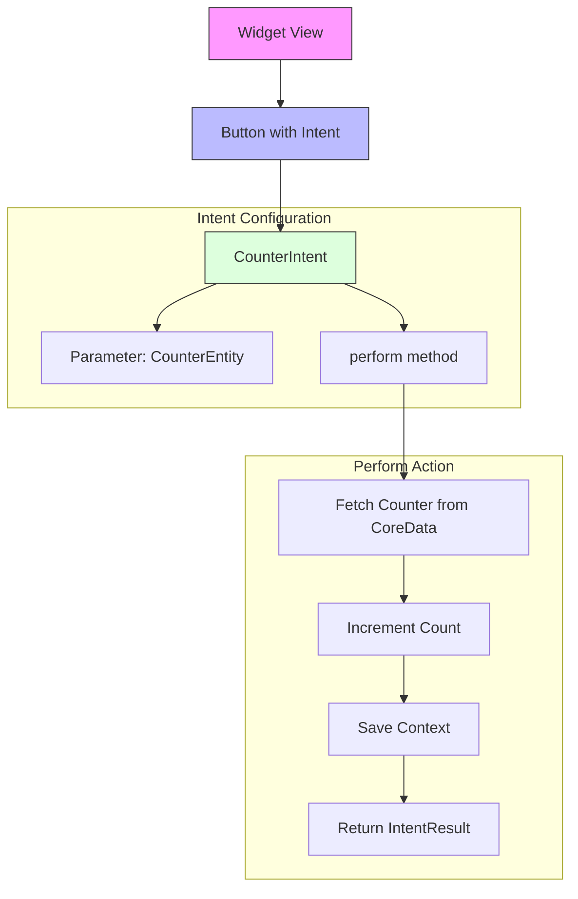

# 介绍

交互式小组件是 iOS17 带来的一大亮点，这篇文章我们会继续用 Counter 的例子，教你如何配置出一个交互式小组件

如果不了解 Widget，请看之前的基础文章，然后再阅读这篇文章

# 交互式小组件的核心

https://developer.apple.com/documentation/SwiftUI/Button/init(_:intent:)-7urde

其实 Button 有一个初始化方法，专门用来接收一个 intent 参数，然后用来执行**init(\_:intent:)**

```swift
Button(intent: CounterAppIntent(counter: counter)) {...}
```

这样就会在 Widget View 中渲染出一个 Button，当点击这个 Button 的时候，会调用指定的 Intent 进行对 counter 的处理

我们之前讲到 WidgetConfigurationIntent 是可以用来配置@Parameter 的，那么其实它还有一个相当重要的方法：perform

先看定义

> **Performs the intent after resolving the provided parameters.**

意思就是 intent 是可以执行的，而执行方法就是通过调用 perform 来处理传入的参数

回顾一下我们之前的 Intent：

```swift
struct CounterIntent: WidgetConfigurationIntent {
    static var title: LocalizedStringResource = "选择计数器"
    static var description: LocalizedStringResource = "选择要显示的计数器"

		// 注意Parameter的类型是我们定义的CounterEntity，它符合AppEntity协议
		// 它会调用CounterQuery(Entity Query)来进行搜索
    @Parameter(title: "计数器",
              optionsProvider: CounterOptionsProvider())
    var counter: CounterEntity
}

```

其实这里，我们只需要给它添加一个 perform 方法：

```swift
    func perform() async throws -> some IntentResult {
		    // 伪代码，通过Core Dat获取数据
        let context = PersistenceController.shared.container.viewContext
        let request = NSFetchRequest<Counter>(entityName: "Counter")
        request.predicate = NSPredicate(format: "id == %@", counter.id as CVarArg)

        // 将值+1
        if let counter = try? context.fetch(request).first {
            counter.count += 1
            try? context.save()
        }

        // 必须要返回的.result()
        return .result()
    }
```

这段代码：

1. 使用 counter.id 找到对应的 Core Data 实体
2. 将其 count 值加 1
3. 保存 context 的更改
4. 返回结果

就是我们想要执行的效果了，很简单对吧？



---

其实基础是最重要的，如果你对小组件的概念还不清楚，欢迎回去看看基础知识和快速入门这两个章节，概念掌握之后，各种新工具就用起来很快了
