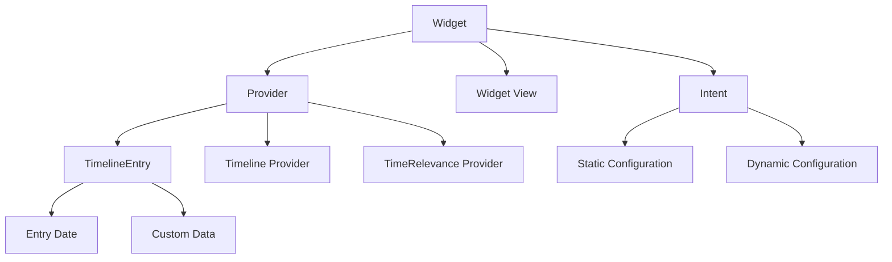

# 介绍

这篇文章中，我会引导你快速完成 Widget 的配置，避免踩坑

# 在项目中支持 Widget

官方文档：https://developer.apple.com/cn/documentation/widgetkit/creating-a-widget-extension/

1. Xcode 中，选择“File”(文件) >“New”(新建) >“Target”(目标)
2. 搜索 Widget，选择 Widget Extension，然后 Next
3. 输入你的 Widget 名字，我一般习惯是 App 名字+Widget
4. Finish 完成创建

这里有个地方要注意，App 和 Widget 是两个分开的 Target，在 Xcode 中，如果你要给 Widget 共享某些文件，你需要在文件的 Target Membership 中，添加 Widget，不然 Widget 是无法找到对应文件的

而且 Xcode 编译不会告诉你这个错误，新手很容易犯这个错误，添加 Widget 后编译失败，就检查一下 Target Membership 是否添加完毕。

如果你的项目很复杂，你可能要给很多文件添加 Widget Target，项目才能启动起来，做好心理准备。

项目配置完毕之后，你就会看到很多模版代码了，可以再回头看看概念，启动一下 Widget 的 Schema，然后自己玩一下，体会苹果对 Widget 的理念。

# 快速适配 Core Data

Core Data 是苹果的亲儿子，历久弥新，其中 Core Data With CloudKit 给 Core Data 添加了 iCloud 同步支持，而 WidgetKit 的也可以通过 AppEntity 的方式来获取 Core Data 的数据

首先，开发者在 Core Data 定义的数据结构叫做 Entity，通过 Core Data，App 可以对 Entity 进行增删查改等操作

然后苹果在 App Intents 里面提出了 App entities 这个概念

https://developer.apple.com/documentation/appintents/app-entities

它的定义是：

> **App entities provide the system with information about your app’s data, or about concepts related to your app’s data.** App entities help the system resolve parameters for app intents by letting it introspect relevant types. For example, a photo app that provides app entities for its photos and albums might also provide app entities to represent “the current photo” or “this album.” These specific app entities help resolve intents more quickly and with fewer verbal interactions.

“App entities provide the system with information about your app’s data, or about concepts related to your app’s data.**”**

App entitys 可为系统提供有关 App 数据或与 App 数据相关概念的信息。

说人话就是，提供一个包装，让外部系统可以访问 App 里面的数据结构

具体的协议是 AppEntity：

https://developer.apple.com/documentation/appintents/appentity

> An interface for exposing a custom type or app-specific concept to system experiences like Siri and the Shortcuts app.

向 Siri 和快捷方式等系统公开自定义类型或特定 App 概念的接口。

翻译过来就是，你声明了一个 AppEntity，Siri、快捷指令这些系统就能获取获取到数据了，如果没有的话，它们是无从得知你的 App 数据的

## 通过例子学习 AppEntity

OK，下面我们用一个例子来介绍

比如说你正在开发一个计数器 App，你的 App 支持用户创建多个 Counter，而每个 counter 都有一个 count 值，用来表示计数值，那么 Core Data 生成的 Entity 是`Counter`

配置 Core Data 生成代码之后，是这样的：

```swift
public class Counter: NSManagedObject {

}

extension Counter {
    @nonobjc public class func fetchRequest() -> NSFetchRequest<Counter> {
        return NSFetchRequest<Counter>(entityName: "Counter")
    }

    @NSManaged public var id: UUID
    @NSManaged public var name: String
    @NSManaged public var count: Int64
}
```

## 添加 App Group

注意了，这个时候，Counter 只能给 App 这个 target 访问，widget target 是访问不到的，此时你需要添加**App Group**

App Group 用于在多个 App 之间，或者 App 和扩展之间共享数据

https://developer.apple.com/documentation/xcode/configuring-app-groups

添加步骤：

1. 选择 target，点击 Signing & Capabilities
2. 搜索并添加 App Groups
3. 然后为当前的 App 创建新的 Group
4. 然后为 App 和 Widget 两个 target 都添加对应的 Group，此时就能完成初步的数据共享了

## 添加 AppEntity

前面提到，Widget 是 App 的扩展，而 Core Data 生成的数据结构，只能在 App 内部使用，那么有没有方法让 Widget 访问到 App 内部的数据呢？

有的，答案就是 AppEntity 和 EntityQuery

https://developer.apple.com/documentation/appintents/appentity

你可以通过下面的方式来让 Widget 访问 App 内的数据

首先是定义一个 AppEntity，你可以理解成它和 CoreData 生成的数据结构是一个唯一映射

```swift
struct CounterEntity: AppEntity {
    static var typeDisplayRepresentation: TypeDisplayRepresentation = "Counter"
    static var defaultQuery = CounterQuery()

    var id: UUID
    var name: String
    var count: Int64

    init(counter: Counter) {
        self.id = counter.id
        self.name = counter.name
        self.count = counter.count
    }

    init(
        id: UUID,
        name: String,
        count: Int64 = 0
    ) {
        self.id = id
        self.name = name
        self.count = count
    }
}
```

那么有了 AppEntity 还是不够的，因为 Widget 并不知道怎么把两个数据实体对应上，这个时候就需要 EntityQuery 了，你只告诉我有 CounterEntity，但是我不知道怎么匹配呀，我通过 id 匹配，还是通过 name、entity 匹配呢？

## EntityQuery

于是我们就需要 EntityQuery 了

官方对于 EntityQuery 的定义也很清晰：

**An interface for locating entities using their identifiers.**

使用标识符定位实体的接口

> 官方文档：https://developer.apple.com/documentation/appintents/entityquery

比如说一个 CounterQuery，应该是下面的样子

```swift
struct CounterQuery: EntityQuery {
    static var typeDisplayRepresentation: TypeDisplayRepresentation = "Counter Query"

    func entities(for identifiers: [UUID]) async throws -> [CounterEntity] {
			...
    }

    func suggestedEntities() async throws -> [CounterEntity] {
			...
    }
}
```

其中，`entities`是查询指定 Entity 的函数

而`suggestedEntities`默认返回所有 Entity，让用户在一堆 Counter 中进行选择

这两个函数足以覆盖日常的使用场景了

有了 AppEntity 和 EntityQuery 的配合，就能够让用户在 Intent 中选择对应的 Counter 进行计数了

## AppEntity、EntityQuery、Widget 一条龙

接下来让我们把这些代码串起来，关于 Widget，再用这个 mermaid 图快速回顾一下



### Intent

首先定义 Intent 配置类：

```swift
struct CounterWidgetConfigurationIntent: WidgetConfigurationIntent {
    static var title: LocalizedStringResource = "选择计数器"
    static var description: LocalizedStringResource = "选择要显示的计数器"

		// 注意Parameter的类型是我们定义的CounterEntity，它符合AppEntity协议
		// 它会调用CounterQuery(Entity Query)来进行搜索
    @Parameter(title: "计数器",
              optionsProvider: CounterOptionsProvider())
    var counter: CounterEntity
}

```

### Provider

创建 Widget Provider

实现三个基本方法：`placeholder`、`snapshot`、`timeline`

```swift
struct CounterWidgetProvider: AppIntentTimelineProvider {
    func placeholder(in context: Context) -> CounterWidgetEntry {
        CounterWidgetEntry(counter: .placeholder)
    }

    func snapshot(for configuration: CounterWidgetConfigurationIntent, in context: Context) async -> CounterWidgetEntry {
        let entry = CounterWidgetEntry(counter: configuration.counter)
        return entry
    }

func timeline(for configuration: CounterWidgetConfigurationIntent, in context: Context) async -> Timeline<CounterWidgetEntry> {

    let counter = configuration.counter
    let entry = CounterWidgetEntry(counter: counter)


    // 这里timeline没必要更新，因为它和时间无关
    return Timeline(entries: [entry], policy: .never)
		}
}

```

### TimelineEntry

根据你的业务需求决定，如果需要你可以填入更多字段来 Widget View 中展示

```swift
struct CounterWidgetEntry: TimelineEntry {
    let counter: CounterEntity
}

extension CounterEntity {
    static var placeholder: CounterEntity {
        CounterEntity(
            id: UUID(),
            name: "打游戏",
            count: 42
        )
    }
}

```

### Widget View

创建 Widget View：

展示 counter 的名字和 count 值

```swift
struct CounterWidgetView : View {
    var entry: CounterWidgetProvider.Entry

    var body: some View {
        VStack {
            Text(entry.counter.name)
                .font(.headline)
            Text("\\(entry.counter.count)")
                .font(.largeTitle)
                .bold()
        }
        .padding()
    }
}

```

### 在 Widget 中把一切组件串起来

最后定义 Widget，把需要的一切组件串起来

```swift
@main
struct CounterWidget: Widget {
    let kind: String = "CounterWidget"

    var body: some WidgetConfiguration {
        AppIntentConfiguration(
            kind: kind,
            intent: CounterWidgetConfigurationIntent.self,
            provider: CounterWidgetProvider()
        ) { entry in
            CounterWidgetView(entry: entry)
        }
        .configurationDisplayName("计数器")
        .description("显示选定计数器的当前值")
        .supportedFamilies([.systemSmall])
    }
}
```

## Widget 跳转功能

如果你需要在 Widget 中配置跳转，比如说点击 Widget，能够快速的进入到某个 Counter 详情页面，那么你需要通过.widgetURL 来声明一个路径

[https://developer.apple.com/documentation/swiftui/view/widgeturl(\_:)](<https://developer.apple.com/documentation/swiftui/view/widgeturl(_:)>)

```swift
struct CounterWidgetView : View {
    var entry: CounterWidgetProvider.Entry

    var body: some View {
        VStack {
            Text(entry.counter.name)
            Text("\\(entry.counter.count)")
        }
        .widgetURL(URL(string: "counter://open/\\(entry.counter.id.uuidString)"))
    }
}

```

然后在 App 中调用`.onOpenURL` 来处理这个 URL Scheme 来打开相应的计数器。
